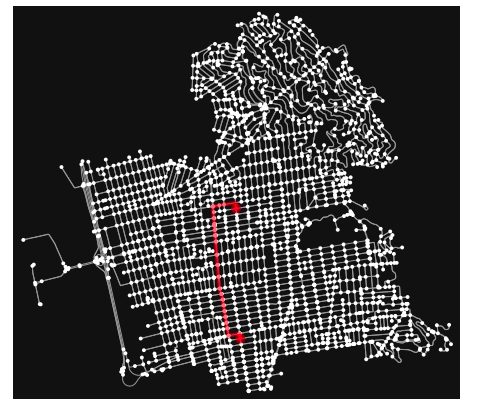
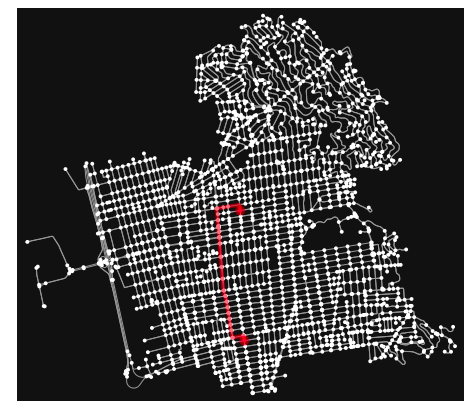
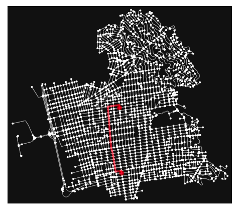

# Motion_Planning

## Search Algorithms

The task was to implement Dijkstra's search algorithm on a road network. This algorithm was then moedifed for a A* search using a distance heuristic. The heuristic used in this case was Euclidean.

### Results

  
   

